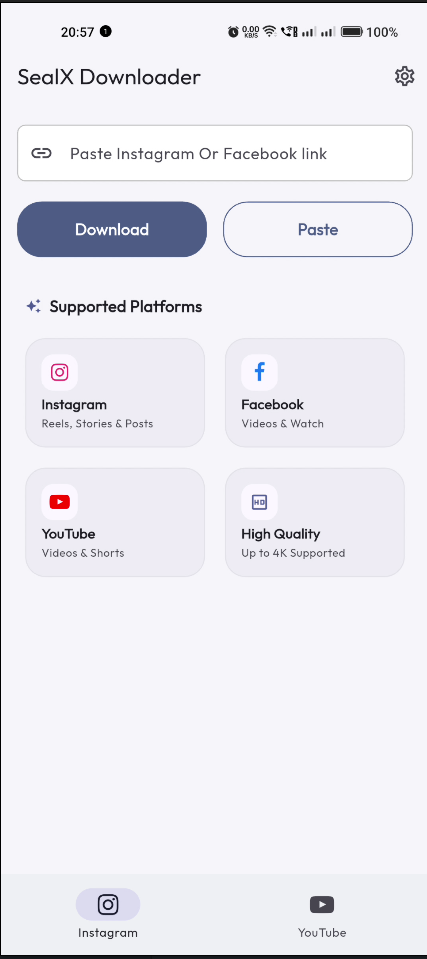
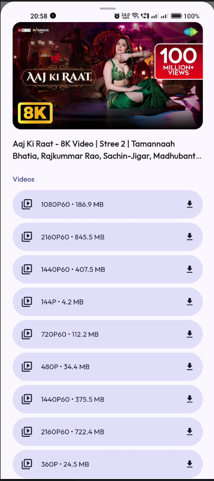
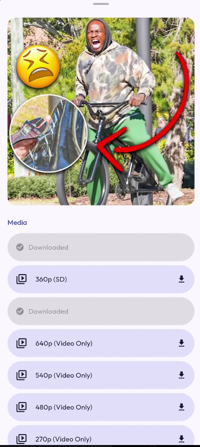
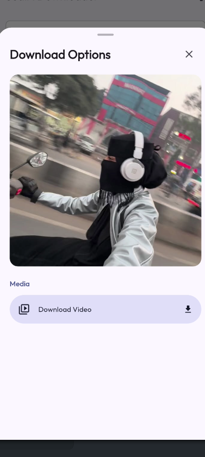
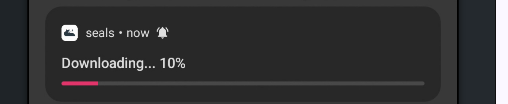

  

  <h1>SealX</h1>
  
  

    <strong>The Ultimate Video Downloader for Android</strong>
  

  
  

    <a href="#features">Features</a> •
    <a href="#screenshots">Screenshots</a> •
    <a href="#download">Download</a>
  

---

## 🚀 About SealX

**SealX** is a powerful and intuitive video downloader application designed to help you save your favorite content from popular social media platforms. Whether it's a YouTube tutorial, an Instagram Reel, or a Facebook video, SealX makes downloading simple and fast.

## ✨ Key Features

- **Multi-Platform Support**: Seamlessly download videos from:
  - **YouTube**: Save videos in various resolutions (from 144p to 4K) or extract audio.
  - **Instagram**: Download Reels, Posts, and IGTV videos.
  - **Facebook**: Save public videos directly to your device.
- **Quality Selection**: Choose your preferred video quality and format before downloading.
- **Real-Time Progress**: Track your active downloads with a clean and informative progress bar.
- **User-Friendly Interface**: A modern, dark-themed UI that is easy to navigate.
- **Fast & Reliable**: Optimized for speed and stability.

## 📸 Screenshots

Explore the sleek interface of SealX:

### **Home & Navigation**
The central hub for all your downloading needs.

  

### **Powerful Downloading Features**

Quality selection for YouTube videos and support for other platforms like Facebook and Instagram.

  <table>
    <tr>
      <td align="center">
        
         
        <strong>YouTube Quality Control</strong>
      </td>
      <td align="center">
        
         
        <strong>Facebook Downloader</strong>
      </td>
      <td align="center">
        
         
        <strong>Instagram Downloader</strong>
      </td>
    </tr>
  </table>

### **Track Your Downloads**
Monitor the progress of your downloads in real-time.

  

## 📥 Download

Get the latest version of SealX from GitHub:

  

**[📱 Download Latest APK](https://github.com/Anshu78780/SealX/releases)**

## 🛠️ Installation

1. Download the APK file.
2. Enable "Install from Unknown Sources" in your device settings.
3. Install and enjoy!

---

  Built with ❤️ by Anshu

# SealX
